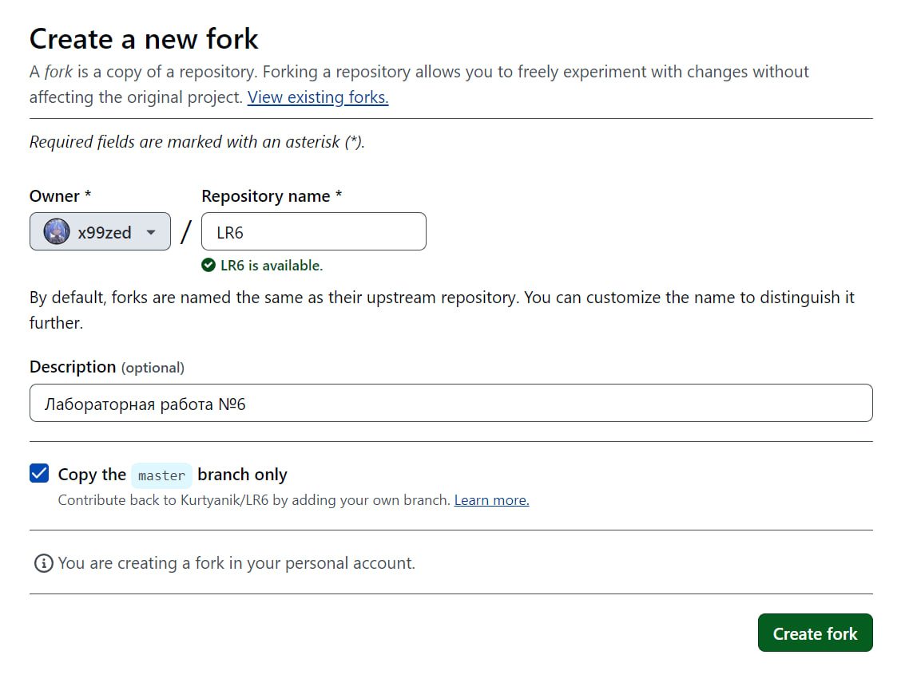

# Лабораторная работа №6: Система контроля версий

**Работу выполнил:** Пуртов Никита

**Группа:** 4314

## Описание лабораторной работы

Цель лабораторной работы: изучение базовых возможностей системы
управления версиями, опыт работы с Git Api, опыт работы с локальным и
удаленным репозиторием.

## Форк репозитория LR6
1. Переходим на страницу репозитория [LR6](https://github.com/Kurtyanik/LR6)

2. Нажимаем кнопку "Fork".



## Установка Git
1. Скачал установщик Git с [официального сайта](https://git-scm.com/).

2. Запустил установщик и следовал инструкциям.

3. Настроил имя пользователя и email, используя следующие команды:
```bash
git config --global user.name "4314 Пуртов Н.С."
git config --global user.email 1nikita05@mail.ru
```

## Клонирование репозитория
1. Клонировал репозиторий на компьютер:
```bash
git clone https://github.com/x99zed/LR6.git```
