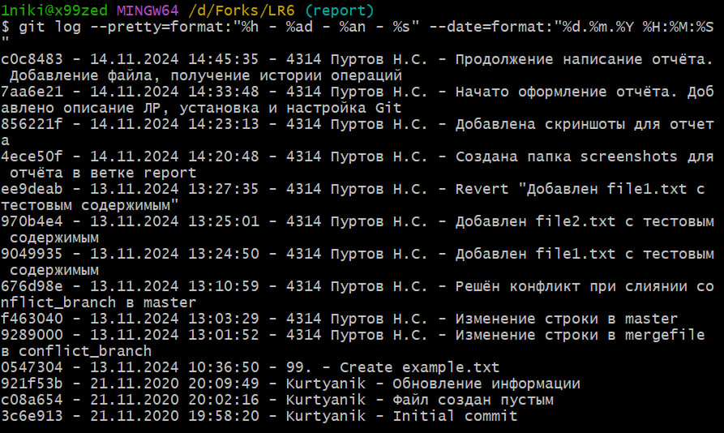

# Лабораторная работа №6: Система контроля версий

**Работу выполнил:** Пуртов Никита

**Группа:** 4314

## Описание лабораторной работы

Цель лабораторной работы: изучение базовых возможностей системы
управления версиями, опыт работы с Git Api, опыт работы с локальным и
удаленным репозиторием.

## Форк репозитория LR6
1. Переходим на страницу репозитория [LR6](https://github.com/Kurtyanik/LR6)

2. Нажимаем кнопку "Fork".


## Установка Git
1. Скачал установщик Git с [официального сайта](https://git-scm.com/).

2. Запустил установщик и следовал инструкциям.

3. Настроил имя пользователя и email, используя следующие команды:
```bash
git config --global user.name "4314 Пуртов Н.С."
git config --global user.email 1nikita05@mail.ru
```

## Клонирование репозитория
1. Клонировал репозиторий на компьютер:
```bash
git clone https://github.com/x99zed/LR6.git
```

## Добавление файла через интерфейс GitHub

1. Нажатием кнопки "Add file" --> "Create new file" был добавлен файл ["example.txt"](example.txt) в репозиторий.

2. Подтянул изменения в локальный репозиторий.
```bash
git pull
```
Работу продолжил локально.

## Получение истории операций

1. Для просмотра истории операций во всех ветках выполнил команду:
```bash
git log --oneline --all
```


## Просмотр последних изменений

1. Для просмотра последних изменений выполнил команду:
```bash
git show
```


## Слияние в ветку master

1. Создал ветку conflict_branch и изменил файл mergefile.txt для вызова конфликта.
Команда для создания новой ветки:
```bash
git checkout -b conflict_branch
```
2. Вернулся в ветку master:
```bash
git checkout master
```
3. Слил ветку master и conflict_branch, решив конфликт:
```bash
git merge conflict_branch
```
Отображение конфликта:


Решение конфликта:


## Удаление побочной ветки после слияния

1. Удалил побочную ветку после слияния с master:
```bash
git branch -d conflict_branch
```
Удаление побочной ветки и отображение всех веток:


## Создание и фиксация изменений, откат коммита

1. Создал первый файл:
```bash
echo "Это первый новый файл" > file1.txt
```
2. Зафиксировал изменения:
```bash
git add file1.txt
git commit -m "Добавлен file1.txt с тестовым содержимым"
```
3. Повторил те же действия со вторым файлом.

4. Выполнил откат коммита с помощью команды:
```bash
git revert 9049935
```
Результат выполнения операций:


## Создание ветки для отчёта

1. Создал новую ветку для отчёта:
```bash
git checkout -b report
```
2. Создал папку [screenshots](screenshots/) и перенёс туда все изображения для прикрепления к отчёту.

## История операций в отчёте
1. Получил историю коммитов в форматированном виде и добавил её в отчёт:
```bash
git log --pretty=format:"%h - %ad - %an - %s" --date=format:"%d.%m.%Y %H:%M:%S"
```



## Выводы
В ходе выполнения лабораторной работы №6 были изучены базовые возможности системы управления версиями, был приобретён опыт работы с Git Api, удалённым и локальным репозиториями.
